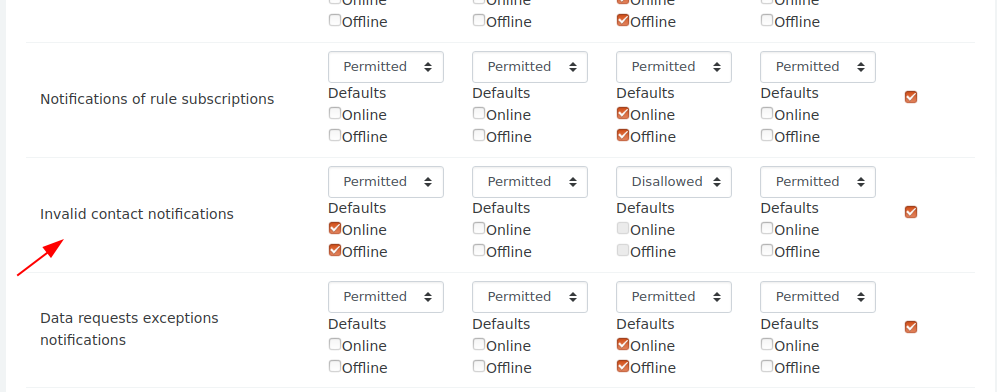

# Configure how invalid contact notifications are sent.

1. Go to Site administration > Messaging > Notification settings > Default notifiction preferences.
2. Find `Invalid contact notifications` and choose how you'd like users to receive notifications about invalid contacts.
   
