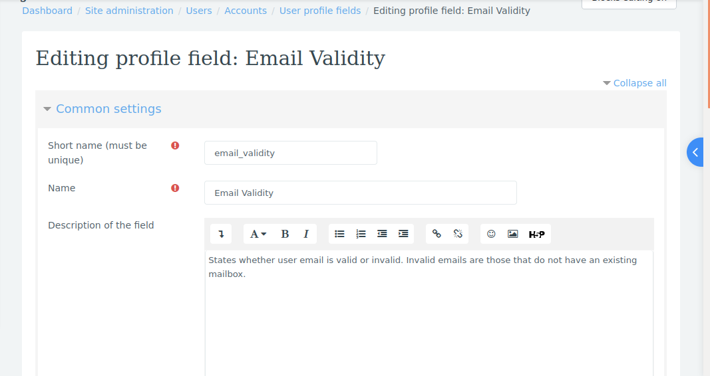
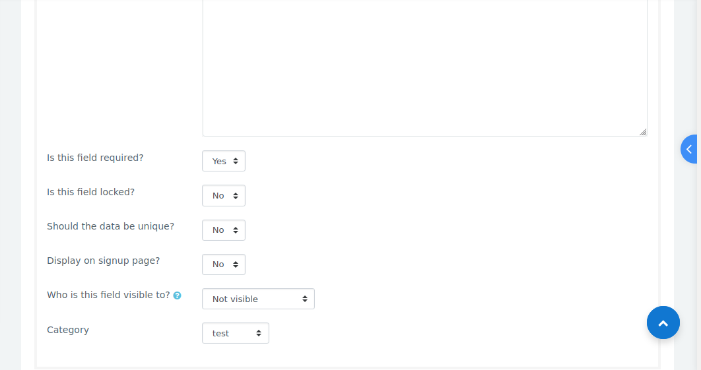
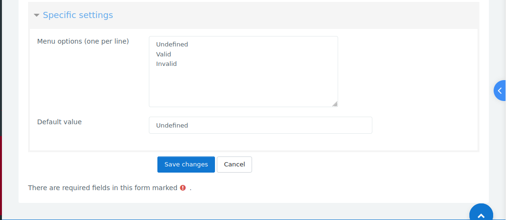

# Set up a custom profile field to show email address status

1.  Go to Site Administration > Users > Accounts > User profile fields.
2.  Add a new profile field with the following details:
    - Short name: `email_validity`.
    - Who is this field visible to?: `Not Visible`. This is to prevent users from editing the field.
    - Menu options: `Undefined`, `Valid` and `Invalid`.
    - Default menu option: `Undefined`.

Fill in the other details as you see fit and click `Save Changes`.
